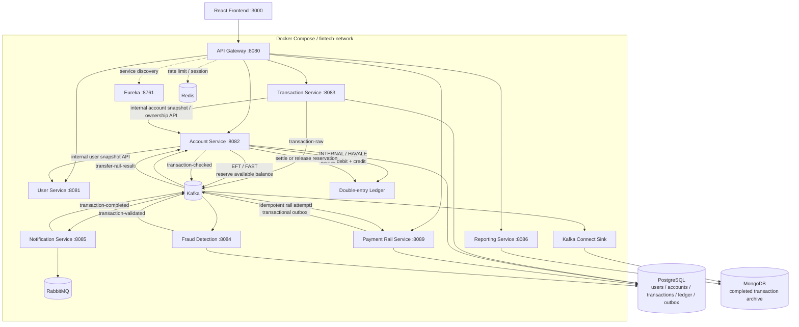

# Fintech Realtime Processing Platform

A real-time fintech transaction processing platform built with Spring Boot microservices, Apache Kafka, PostgreSQL, MongoDB, Redis, RabbitMQ, Docker, and Spring Cloud.

The system processes financial transactions through an event-driven pipeline that includes validation, fraud detection, balance updates, notifications, and transaction archiving.

## Local configuration

Copy `.env.example` to `.env` and replace every password, `JWT_ACCESS_SECRET`, and `JWT_REFRESH_SECRET` before starting the stack. Access and refresh secrets must be different. `.env` is intentionally ignored by Git.

The Docker Compose defaults expose only the frontend, API gateway, and local-only operational interfaces. Internal microservices, databases, and brokers are reachable only on the Docker network.

For an existing PostgreSQL volume, apply schema updates with `./manage.sh migrate` before starting a version that requires a new table or column.


---

# Architecture Overview



The pipeline resolves another platform user's IBAN as an atomic HAVALE. Transfers to an external bank reserve funds first; Payment Rail Service then simulates EFT/FAST execution idempotently, after which Account Service either settles the reservation into the ledger or releases it without losing money.

## Service data ownership

The local Docker environment uses one PostgreSQL instance with separate logical schemas, but domain services do not query or join another service's business tables at runtime:

* `user-service` owns user and refresh-token data in `user_service`.
* `account-service` owns accounts, reservations, ledger journals, inbox records, and account outbox events in `account_service`.
* `transaction-service` owns transaction state, status history, and transaction outbox events in `transaction_service`.
* Transaction Service resolves account ownership, status, currency, and IBAN routing through Account Service's internal REST API.
* Account Service resolves beneficiary display names through User Service's internal REST API instead of joining `user_service.users`.
* Internal endpoints are not routed by the API Gateway and the service ports are not published to the host by Docker Compose.
* If an owning service is unavailable, callers fail explicitly with `503 SERVICE_UNAVAILABLE` rather than falling back to another service's tables.

This removes the runtime cross-schema coupling from the User–Account–Transaction domain flow while preserving the current single-instance local deployment. The shared audit component is a documented transitional exception: Account and Transaction services currently persist centralized audit records in `audit_service`. Extracting that storage behind an Audit Service or an event consumer is listed under Future Improvements.

---

## UI Preview


<details>
<summary>See more screenshots</summary>

### Accounts


### Transactions


### New Transaction


### Administrator tasks


</details>

---

# Features

* Real-time transaction processing
* Event-driven microservice architecture
* Fraud and AML validation pipeline
* Account balance update and transaction persistence
* Email / SMS / push notification support
* PostgreSQL for operational data
* MongoDB for completed transaction archive
* Redis for cache, session, and distributed lock support
* RabbitMQ for asynchronous notification delivery
* Explicit service-owned data boundaries with internal REST lookups instead of cross-schema domain queries
* Eureka-based service discovery
* API Gateway routing with Spring Cloud Gateway
* Immutable audit trail for account and transaction access/changes
* Rotating refresh tokens with reuse detection and server-side revocation
* Mandatory request idempotency and type-aware money-movement validation
* Enforced per-account daily spending limits and locked transaction state transitions
* Immutable double-entry ledger with account reconciliation APIs
* IBAN-based HAVALE/EFT/FAST routing with beneficiary verification
* ISO 13616 MOD-97 validation and checksum-correct Turkish IBAN generation
* Reserve-before-send external transfers with automatic release on rejection
* Idempotent Payment Rail attempts with hashed and masked IBAN persistence
* Idempotent Redis daily fraud aggregates using integer minor units
* Docker Compose environment for all services
* Kafka UI for topic monitoring

---

# Tech Stack

## Backend

* Java 17
* Spring Boot
* Spring Cloud Gateway
* Spring Security
* Spring Data JPA
* Hibernate
* Spring Cloud Netflix Eureka

## Messaging

* Apache Kafka
* Kafka Connect
* RabbitMQ

## Databases

* PostgreSQL
* MongoDB
* Redis

## Frontend

* React

## Infrastructure

* Docker
* Docker Compose
* Kafka UI
* Zookeeper

---

# Microservices

## API Gateway

Port: `8080`

Responsibilities:

* Single entry point for the frontend
* Route requests to microservices
* Validate access-token signature, issuer, audience, type, and required roles
* Apply Redis-backed request rate limiting

---

## User Service

Port: `8081`

Responsibilities:

* User registration and authentication
* Short-lived access JWT and rotating refresh-token families
* HttpOnly refresh cookie, hashed token persistence, reuse detection, and logout revocation
* Role-based access control
* Provide an internal user snapshot API for service-to-service identity lookups

Database schema:

* `user_service`

### Access and refresh token security

Access and refresh tokens have separate responsibilities and signing secrets:

* Access tokens expire after 15 minutes by default and are the only tokens accepted by the API Gateway.
* Refresh tokens expire after 7 days by default and are sent only in an `HttpOnly`, `SameSite` cookie. They are never returned in the JSON body or stored in browser storage.
* JWT validation requires the expected signature, issuer, audience, `tokenType`, and expiration. Every generated token also carries a unique token ID (`jti`).
* Only a SHA-256 hash of each refresh token is stored in PostgreSQL.
* Every refresh rotates the token. Reusing an already rotated token revokes the complete token family, limiting damage from a stolen token.
* Logout revokes the current refresh-token family and clears the cookie.
* The frontend coalesces concurrent refresh attempts so parallel `401` responses do not race the one-time token rotation.

Use different, long random values for `JWT_ACCESS_SECRET` and `JWT_REFRESH_SECRET`. For HTTPS production deployments, set `AUTH_REFRESH_COOKIE_SECURE=true`. Existing PostgreSQL volumes must be upgraded before the new user-service version starts:

```bash
./manage.sh migrate
```

---

## Account Service

Port: `8082`

Responsibilities:

* Update account balances
* Enforce ownership, account status, currency, balance, and daily-limit invariants
* Own account lookup and beneficiary resolution APIs used by other services
* Resolve beneficiary names through User Service without querying the user schema
* Lock transfer accounts in deterministic order to prevent concurrent deadlocks
* Atomically persist balances, consumer inbox claims, outbox events, and balanced ledger journals
* Store account/transaction audit records in `audit_service.audit_logs`

Consumes:

* `transaction-validated`
* `transfer-rail-result`

Produces:

* `transaction-checked`
* `funds-reserved`

Database schema:

* `account_service`

For external EFT/FAST transfers, `balance` is not immediately debited. The amount is added to `reserved_balance`, which reduces `availableBalance`. A successful rail result settles the reservation and posts a balanced journal; a rejected result releases both the reservation and the consumed daily limit.

### Ledger and reconciliation APIs

Every posted money movement creates one immutable journal with equal debit and credit totals. The database rejects ledger updates and deletes; no mutation endpoint is exposed.

* `GET /api/v1/accounts/{accountId}/ledger` lists the authenticated owner's account entries.
* `GET /api/v1/accounts/ledger/transactions/{transactionId}` returns both journal sides and calculated debit/credit totals.
* `GET /api/v1/accounts/{accountId}/reconciliation` compares the operational balance with the latest ledger balance.

### Audit log API

`GET /api/v1/audit-logs?page=0&size=50` is routed through the API Gateway and is restricted to the `ADMIN` role. Optional `actorUsername`, `action`, and `resourceType` filters are supported. It returns the actor, time, action, account/transaction resource, service, and trusted client IP.

Successful account and transaction reads/creates are recorded automatically. Audit records are append-only at the application level; no update or delete API is exposed.

---

## Transaction Service

Port: `8083`

Responsibilities:

* Receive transaction requests
* Require an idempotency key and apply type-specific source/target account rules
* Resolve account snapshots and user-owned account IDs through Account Service
* Query only transaction-owned tables when building transaction histories
* Reject same-account transfers, inactive/currency-mismatched accounts, and user-created deposits
* Enforce a locked state machine so duplicate events are no-ops and invalid status regressions fail
* Publish transaction events to Kafka

Produces:

* `transaction-raw`

Database schema:

* `transaction_service`

---

## Fraud Detection Service

Port: `8084`

Responsibilities:

* Fraud and AML checks
* Detect suspicious transaction behavior
* Validate single transaction amount and frequency
* Track daily account totals atomically and idempotently in Redis

Consumes:

* `transaction-raw`

Produces:

* `transaction-validated`

Database schema:

* `fraud_service`

---

## Payment Rail Service

Port: `8089`

Responsibilities:

* Resolve and mask IBAN beneficiaries before submission
* Route internal-bank IBANs to HAVALE and external TRY transfers to the configured FAST/EFT simulation policy
* Consume reserved-fund events and create one idempotent payment attempt per transaction
* Persist only the SHA-256 hash and masked form of the beneficiary IBAN in the rail-attempt table
* Publish successful or rejected rail results through a transactional outbox

Consumes:

* `funds-reserved`

Produces:

* `transfer-rail-result`

Database schema:

* `payment_rail_service`

---

## Notification Service

Port: `8085`

Responsibilities:

* Send email, SMS, or push notifications
* Forward notification tasks to RabbitMQ workers

Consumes:

* `transaction-checked`

Produces:

* `transaction-processed`
* `transaction-completed`

---

## Reporting Service

Port: `8086`

Responsibilities:

* Dashboard and reporting APIs
* Query completed transactions from MongoDB
* Provide analytics and statistics

---

## Eureka Server

Port: `8761`

Responsibilities:

* Service registration and discovery
* Dynamic routing and load balancing support

---

# Kafka Topic Pipeline

```text
transaction-raw → transaction-validated
                           │
                           ├─ INTERNAL / HAVALE → atomic account + ledger update
                           │
                           └─ EFT / FAST → reserve funds → funds-reserved
                                                        ↓
                                                Payment Rail Service
                                                        ↓
                                                transfer-rail-result
                                                        ↓
                                                settle or release funds
                           ↓
transaction-checked → transaction-processed → transaction-completed
```

Each topic represents a stage of the transaction lifecycle.

## Reliable event delivery

The money-movement path uses the Transactional Outbox and Consumer Inbox patterns:

* `transaction-service` stores the new transaction and its `transaction-raw` outbox event in the same PostgreSQL transaction.
* `account-service` atomically claims each transaction event in `processed_events`, updates balances, and writes the next outbox event.
* EFT/FAST has two independent inbox identities: reservation and settlement. Duplicate delivery at either stage is a no-op.
* `payment-rail-service` stores the payment attempt and its `transfer-rail-result` outbox event in one PostgreSQL transaction.
* Duplicate Kafka deliveries are ignored by the `(consumer_name, event_id)` primary key, so a balance operation is applied once.
* Outbox publishers wait for Kafka acknowledgement before marking an event `PUBLISHED`. Failed sends stay `PENDING` and are retried.
* Account consumer failures are retried and then published to `transaction-dlq` instead of being swallowed.
* Fraud and transaction-status consumers also propagate failures to Kafka retry/DLQ handling; a logged exception is never treated as successful processing.

Because outbox delivery is intentionally at-least-once, downstream consumers must also be idempotent when they perform non-repeatable side effects.

## Financial domain integrity

The money path applies defense in depth in the request DTO, transaction service, account service, and PostgreSQL constraints:

* API-created accounts always start with zero balance. Demo and migrated opening balances receive balanced ledger opening journals.
* `TRANSFER` requires two different accounts; `PAYMENT` and `WITHDRAWAL` require only a source; `DEPOSIT` requires only a target and an `ADMIN` initiator.
* Both sides of a transfer must be active and use the transaction currency. Cross-currency transfer without an FX leg is rejected.
* Outgoing amounts consume the account's Istanbul-business-day limit in the same transaction as the balance update.
* External transfer amounts are removed from `availableBalance` by a durable reservation before the simulated bank call; a rejection releases the reservation and daily-limit usage.
* Turkish IBANs are normalized and verified with MOD-97; newly opened accounts receive checksum-correct IBANs.
* HAVALE to an account inside this platform remains one atomic debit/credit transaction. The demo routes external TRY amounts up to and including 20,000 TRY to FAST and larger amounts to EFT; this is an application simulation rule, not a claimed regulatory limit.
* Ledger posting, balance mutation, consumer inbox claim, and account outbox creation commit or roll back together.
* Transaction statuses follow explicit allowed transitions under a pessimistic database lock. Repeated status events are idempotent.

---

## Automated tests and CI

The account money-transfer path has Testcontainers integration coverage with real PostgreSQL 16 and Kafka containers. The tests verify that:

* a transfer debits and credits the correct accounts;
* duplicate Kafka delivery changes balances only once;
* the consumer inbox and outbox are committed with the balance update;
* the next `transaction-checked` event is published through Kafka;
* insufficient balance rolls back the database transaction and routes the event to `transaction-dlq`.
* daily-limit violations roll back balance, daily usage, inbox, outbox, and ledger together;
* every transfer produces exactly two immutable ledger entries with equal debit and credit totals;
* client-created deposits, same-account transfers, and out-of-order status regressions are rejected;
* fraud daily rules evaluate an idempotent Redis aggregate rather than one transaction in isolation.
* successful external transfers reserve then settle funds and create a balanced clearing journal;
* rejected external transfers restore available balance and daily-limit usage without creating a ledger posting;
* Payment Rail duplicate events do not create a second attempt or result, and persisted rail records contain no plain IBAN.

Docker must be running to execute the integration suite locally:

```bash
mvn -f common-library/pom.xml install
mvn -f account-service/pom.xml verify
```

The GitHub Actions workflow in `.github/workflows/ci.yml` runs all backend tests, the Testcontainers transfer scenarios, the frontend production build, and Docker Compose validation on every push and pull request. Test reports are uploaded as workflow artifacts even when a backend test fails.

---

# Database Design

## PostgreSQL

Used for operational and transactional data.

Schemas:

* `user_service`
* `account_service`
* `transaction_service`
* `fraud_service`
* `payment_rail_service`

These schemas share one PostgreSQL instance in the local Docker topology, but they represent logical ownership boundaries. User, Account, and Transaction domain reads no longer cross those boundaries with SQL joins or native queries; service-owned information is requested through internal APIs. Separate PostgreSQL instances can therefore be introduced later without rewriting these domain queries.

Example tables:

* `users`
* `refresh_tokens`
* `accounts`
* `transactions`
* `fraud_check_results`
* `ledger_transactions`
* `ledger_entries`
* `fund_reservations`
* `payment_rail_attempts`
* `processed_events`
* `outbox_events`

---

## MongoDB

Used to archive completed transactions and support reporting queries.

The archive flow:

```text
transaction-completed
      ↓
Kafka Connect Sink
      ↓
MongoDB
```

---

# Service Discovery

All services register themselves in Eureka.

Example configuration:

```yaml
spring:
  application:
    name: transaction-service

eureka:
  client:
    service-url:
      defaultZone: http://localhost:8761/eureka/
```

Example gateway route:

```yaml
uri: lb://TRANSACTION-SERVICE
```

---

# Running the Project

## 1. Clone the repository

```bash
git clone <repository-url>
cd fintech-realtime-processing
```

## 2. Start the infrastructure

```bash
docker-compose up -d
```

This starts:

* PostgreSQL
* MongoDB
* Redis
* RabbitMQ
* Kafka
* Zookeeper
* Kafka UI

---

## 3. Start Eureka Server

```bash
cd eureka-server
mvn spring-boot:run
```

Open:

```text
http://localhost:8761
```

---

## 4. Start the microservices

Run the following services in order:

1. `user-service`
2. `transaction-service`
3. `fraud-detection-service`
4. `account-service`
5. `payment-rail-service`
6. `notification-service`
7. `reporting-service`
8. `api-gateway`

Example:

```bash
cd transaction-service
mvn spring-boot:run
```

---

# Monitoring

Kafka UI:

```text
http://localhost:9090
```

Eureka Dashboard:

```text
http://localhost:8761
```

API Gateway:

```text
http://localhost:8080
```

---

## Runtime Infrastructure Evidence

<details>
<summary>View infrastructure dashboards</summary>

### Kafka UI


### RabbitMQ


### Eureka


### Redis — Fraud Velocity & Idempotent Aggregates
Fraud Detection Service stores expiring velocity counters, atomic daily
transaction totals, and processed-event markers that prevent duplicate Kafka
events from incrementing an account total twice.


Spring Cloud Gateway uses Redis-backed token buckets to apply per-IP request
limits. Token and timestamp keys expire automatically when request traffic stops.


</details>

---

# Future Improvements

* Distributed transaction management with Saga Pattern
* Extract the shared `audit_service` schema behind a dedicated Audit Service or Kafka consumer
* Extend Consumer Inbox idempotency to notification and reporting side effects
* Operational DLQ replay tooling
* Centralized logging with ELK or Grafana
* OpenTelemetry and tracing
* Resilience4j circuit breaker and retry
* Kubernetes deployment
* AI-based fraud detection model

---

# Example Resume Description

Developed a real-time fintech transaction platform with Spring Boot microservices, Kafka, PostgreSQL, Redis, MongoDB, RabbitMQ, and Docker. Enforced service-owned domain boundaries by replacing cross-schema User–Account–Transaction queries with internal REST APIs. Implemented transactional outbox/consumer idempotency, secure refresh-token rotation, IBAN-based HAVALE/EFT/FAST orchestration with reserve-settle-release semantics, financial invariants and daily limits, an immutable double-entry ledger, retry/DLQ handling, and Testcontainers end-to-end tests executed in GitHub Actions CI.
